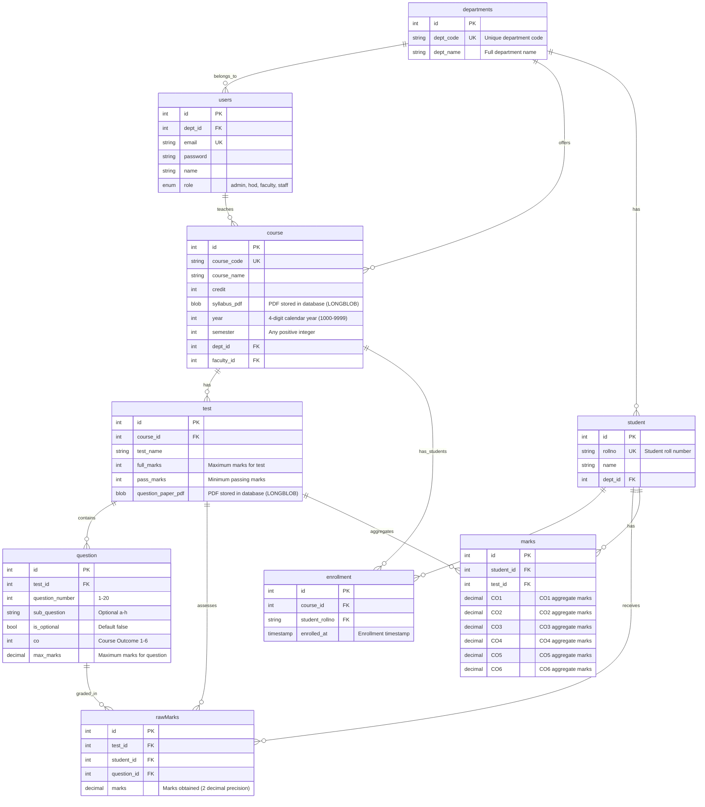

# NBA Assessment System - Database Schema

## ERD Diagram



---

## Table Definitions

### 1. departments
Organization structure for academic departments.

| Column | Type | Constraints | Description |
|--------|------|-------------|-------------|
| id | INT | PRIMARY KEY, AUTO_INCREMENT | Unique identifier |
| dept_code | VARCHAR(10) | UNIQUE, NOT NULL | Short code (e.g., "CSE", "ECE") |
| dept_name | VARCHAR(255) | NOT NULL | Full name (e.g., "Computer Science") |

**Indexes**: PRIMARY KEY (id), UNIQUE KEY (dept_code)

---

### 2. users
System users (faculty, HOD, admin, staff) with JWT authentication.

| Column | Type | Constraints | Description |
|--------|------|-------------|-------------|
| id | INT | PRIMARY KEY, AUTO_INCREMENT | Unique identifier |
| dept_id | INT | FOREIGN KEY → departments(id) | Department assignment |
| email | VARCHAR(255) | UNIQUE, NOT NULL | Login email |
| password | VARCHAR(255) | NOT NULL | Bcrypt hashed password |
| name | VARCHAR(255) | NOT NULL | Full name |
| role | ENUM | 'admin', 'hod', 'faculty', 'staff' | Authorization level |

**Indexes**: PRIMARY KEY (id), UNIQUE KEY (email), KEY (dept_id)  
**Foreign Keys**: dept_id REFERENCES departments(id) ON DELETE CASCADE

---

### 3. course
Academic courses with syllabi and year/semester info.

| Column | Type | Constraints | Description |
|--------|------|-------------|-------------|
| id | INT | PRIMARY KEY, AUTO_INCREMENT | Unique identifier |
| course_code | VARCHAR(20) | UNIQUE, NOT NULL | Course code (e.g., "CS101") |
| course_name | VARCHAR(255) | NOT NULL | Full course name |
| credit | INT | DEFAULT 3 | Credit hours |
| syllabus_pdf | LONGBLOB | NULL | Syllabus PDF (binary data) |
| year | INT(4) | NOT NULL | Calendar year (e.g., 2024) |
| semester | INT | NOT NULL | Semester number (1, 2, 3...) |
| dept_id | INT | FOREIGN KEY → departments(id) | Offering department |
| faculty_id | INT | FOREIGN KEY → users(id) | Course instructor |

**Indexes**: PRIMARY KEY (id), UNIQUE KEY (course_code), KEY (dept_id), KEY (faculty_id)  
**Foreign Keys**:
- dept_id REFERENCES departments(id) ON DELETE CASCADE
- faculty_id REFERENCES users(id) ON DELETE SET NULL

**PDF Filename**: Auto-generated as `{course_code}_{year}_{semester}.pdf`

---

### 4. test
Assessments with question papers (Mid-sem, End-sem, etc.).

| Column | Type | Constraints | Description |
|--------|------|-------------|-------------|
| id | INT | PRIMARY KEY, AUTO_INCREMENT | Unique identifier |
| course_id | INT | FOREIGN KEY → course(id) | Parent course |
| test_name | VARCHAR(255) | NOT NULL | Test name (e.g., "Mid Semester") |
| full_marks | INT | NOT NULL | Maximum marks |
| pass_marks | INT | NOT NULL | Passing threshold |
| question_paper_pdf | LONGBLOB | NULL | Question paper PDF (binary) |

**Indexes**: PRIMARY KEY (id), KEY (course_id)  
**Foreign Keys**: course_id REFERENCES course(id) ON DELETE CASCADE

**PDF Filename**: Auto-generated as `{course_code}_{year}_{semester}_{test_name}.pdf`

---

### 5. question
Individual questions with CO mapping and marks.

| Column | Type | Constraints | Description |
|--------|------|-------------|-------------|
| id | INT | PRIMARY KEY, AUTO_INCREMENT | Unique identifier |
| test_id | INT | FOREIGN KEY → test(id) | Parent test |
| question_number | INT | 1-20 | Main question number |
| sub_question | CHAR(1) | 'a'-'h' or NULL | Sub-question letter |
| is_optional | BOOLEAN | DEFAULT false | Optional question flag |
| co | INT | 1-6 | Course Outcome mapping |
| max_marks | DECIMAL(5,2) | > 0 | Maximum marks |

**Indexes**: PRIMARY KEY (id), KEY (test_id), UNIQUE KEY (test_id, question_number, sub_question)  
**Foreign Keys**: test_id REFERENCES test(id) ON DELETE CASCADE

**Note**: Question text is in the test's question_paper_pdf. This table only stores metadata.

---

### 6. student
Student information with roll numbers.

| Column | Type | Constraints | Description |
|--------|------|-------------|-------------|
| id | INT | PRIMARY KEY, AUTO_INCREMENT | Unique identifier |
| rollno | VARCHAR(50) | UNIQUE, NOT NULL | Student roll number |
| name | VARCHAR(255) | NOT NULL | Full name |
| dept_id | INT | FOREIGN KEY → departments(id) | Department |

**Indexes**: PRIMARY KEY (id), UNIQUE KEY (rollno), KEY (dept_id)  
**Foreign Keys**: dept_id REFERENCES departments(id) ON DELETE CASCADE

---

### 7. enrollment
Student-course enrollment relationship.

| Column | Type | Constraints | Description |
|--------|------|-------------|-------------|
| id | INT | PRIMARY KEY, AUTO_INCREMENT | Unique identifier |
| course_id | INT | FOREIGN KEY → course(id) | Course |
| student_rollno | VARCHAR(50) | FOREIGN KEY → student(rollno) | Student |
| enrolled_at | TIMESTAMP | DEFAULT CURRENT_TIMESTAMP | Enrollment time |

**Indexes**: PRIMARY KEY (id), KEY (course_id), KEY (student_rollno), UNIQUE KEY (course_id, student_rollno)  
**Foreign Keys**:
- course_id REFERENCES course(id) ON DELETE CASCADE
- student_rollno REFERENCES student(rollno) ON DELETE CASCADE

**Constraint**: Prevents duplicate enrollments (same student in same course)

---

### 8. rawMarks
Per-question marks for each student.

| Column | Type | Constraints | Description |
|--------|------|-------------|-------------|
| id | INT | PRIMARY KEY, AUTO_INCREMENT | Unique identifier |
| test_id | INT | FOREIGN KEY → test(id) | Test |
| student_id | INT | FOREIGN KEY → student(id) | Student |
| question_id | INT | FOREIGN KEY → question(id) | Question |
| marks | DECIMAL(5,2) | >= 0 | Marks obtained |

**Indexes**: PRIMARY KEY (id), KEY (test_id), KEY (student_id), KEY (question_id), UNIQUE KEY (student_id, question_id)  
**Foreign Keys**:
- test_id REFERENCES test(id) ON DELETE CASCADE
- student_id REFERENCES student(id) ON DELETE CASCADE
- question_id REFERENCES question(id) ON DELETE CASCADE

**Purpose**: Granular marks entry, used to calculate CO aggregates in `marks` table.

---

### 9. marks
CO-aggregated marks for each student per test.

| Column | Type | Constraints | Description |
|--------|------|-------------|-------------|
| id | INT | PRIMARY KEY, AUTO_INCREMENT | Unique identifier |
| student_id | INT | FOREIGN KEY → student(id) | Student |
| test_id | INT | FOREIGN KEY → test(id) | Test |
| CO1 | DECIMAL(5,2) | DEFAULT 0.00 | CO1 total marks |
| CO2 | DECIMAL(5,2) | DEFAULT 0.00 | CO2 total marks |
| CO3 | DECIMAL(5,2) | DEFAULT 0.00 | CO3 total marks |
| CO4 | DECIMAL(5,2) | DEFAULT 0.00 | CO4 total marks |
| CO5 | DECIMAL(5,2) | DEFAULT 0.00 | CO5 total marks |
| CO6 | DECIMAL(5,2) | DEFAULT 0.00 | CO6 total marks |

**Indexes**: PRIMARY KEY (id), KEY (student_id), KEY (test_id), UNIQUE KEY (student_id, test_id)  
**Foreign Keys**:
- student_id REFERENCES student(id) ON DELETE CASCADE
- test_id REFERENCES test(id) ON DELETE CASCADE

**Purpose**: NBA-ready CO aggregates. Auto-calculated from rawMarks based on question.co mapping.

---

## Schema Changes Log

### v1.0 (January 2025) - PDF Storage Implementation

#### Course Table
- ❌ **Removed**: `syllabus VARCHAR(500)` (URL field)
- ✅ **Added**: `syllabus_pdf LONGBLOB` (binary PDF storage)
- **Filename**: Auto-generated as `{course_code}_{year}_{semester}.pdf`

#### Test Table
- ❌ **Removed**: `question_link VARCHAR(500)` (URL field)
- ✅ **Added**: `question_paper_pdf LONGBLOB` (binary PDF storage)
- **Filename**: Auto-generated as `{course_code}_{year}_{semester}_{test_name}.pdf`

#### Question Table
- ❌ **Removed**: `description TEXT` (question text)
- **Reason**: Question content is in the PDF, table only stores metadata

**Migration**:
```sql
ALTER TABLE course
  DROP COLUMN syllabus,
  ADD COLUMN syllabus_pdf LONGBLOB DEFAULT NULL;

ALTER TABLE test
  DROP COLUMN question_link,
  ADD COLUMN question_paper_pdf LONGBLOB DEFAULT NULL;

ALTER TABLE question
  DROP COLUMN description;
```

---

## Relationships

### One-to-Many
- **departments → users**: One department has many users
- **departments → course**: One department offers many courses
- **departments → student**: One department has many students
- **users → course**: One faculty teaches many courses
- **course → test**: One course has many tests
- **course → enrollment**: One course has many enrollments
- **test → question**: One test contains many questions
- **test → rawMarks**: One test has many raw marks entries
- **test → marks**: One test has many aggregate marks entries
- **student → enrollment**: One student enrolls in many courses
- **student → rawMarks**: One student has many raw marks entries
- **student → marks**: One student has many aggregate marks
- **question → rawMarks**: One question has many marks entries

### Unique Constraints
- **enrollment**: (course_id, student_rollno) - Prevents duplicate enrollments
- **rawMarks**: (student_id, question_id) - One marks entry per question per student
- **marks**: (student_id, test_id) - One CO aggregate per test per student
- **question**: (test_id, question_number, sub_question) - Prevents duplicate questions

---

## Cascade Behavior

### ON DELETE CASCADE
- Delete department → Delete all users, courses, students
- Delete user (faculty) → Set faculty_id to NULL in courses
- Delete course → Delete all tests, enrollments
- Delete test → Delete all questions, rawMarks, marks
- Delete student → Delete all enrollments, rawMarks, marks
- Delete question → Delete all rawMarks for that question

**Purpose**: Maintain referential integrity, clean up orphaned data

---

## Design Philosophy

### Dual Marks Storage
- **rawMarks**: Granular per-question data for marks entry
- **marks**: CO aggregates for NBA reporting
- **Sync**: marks table updated automatically when rawMarks change

### PDF Storage
- **LONGBLOB**: Supports files up to ~4GB (recommend < 10MB)
- **Base64**: API uses base64 encoding for transmission
- **Auto-filenames**: Generated from course/test metadata for consistency
- **Backup**: Single database dump includes all documents

### Authorization
- **faculty_id in course**: Determines who can modify course/test/marks
- **role in users**: Admin/HOD have elevated permissions
- **JWT**: Token contains user_id and role for authorization checks

---

## Performance Considerations

### Indexes
- Primary keys on all tables
- Foreign keys indexed automatically
- Unique constraints on business keys (rollno, email, course_code)
- Composite unique keys prevent duplicates

### Query Optimization
- SELECT excludes LONGBLOB columns by default
- Use explicit column selection for large tables
- JOIN queries use indexed foreign keys
- Aggregate queries (CO totals) use indexed marks table

### Storage
- LONGBLOB adds ~100KB-2MB per document
- For 100 courses + 500 tests: ~150MB additional storage
- Recommend separate download endpoints for large PDFs

---

## Setup

### Create Database
```sql
CREATE DATABASE nba_db CHARACTER SET utf8mb4 COLLATE utf8mb4_unicode_ci;
```

### Import Schema
```bash
mysql -u username -p nba_db < docs/db.sql
```

### Verify
```sql
USE nba_db;
SHOW TABLES;
-- Expected: 9 tables
```

---

**See Also**:
- `db.sql` - Complete schema with sample data
- `API_REFERENCE.md` - API endpoints that use this schema
- `COMPLETE_GUIDE.md` - Full project documentation
