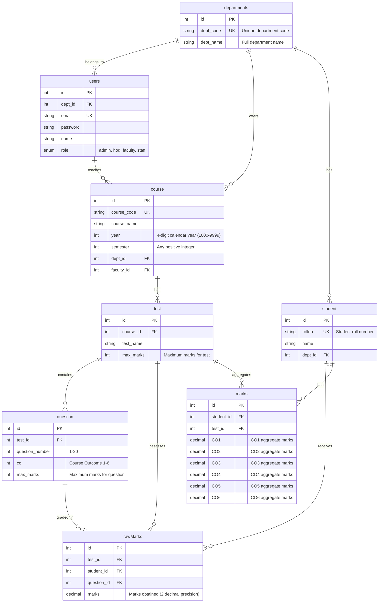

# Database Schema Documentation

## Entity Relationship Diagram



## Table Descriptions

### 1. departments
**Purpose**: Stores academic departments in the institution.

| Column | Type | Constraints | Description |
|--------|------|-------------|-------------|
| id | INT | PRIMARY KEY, AUTO_INCREMENT | Unique department identifier |
| dept_code | VARCHAR(10) | UNIQUE, NOT NULL | Short department code (e.g., CSE, ECE) |
| dept_name | VARCHAR(100) | NOT NULL | Full department name |

**Indexes**:
- PRIMARY KEY on `id`
- UNIQUE INDEX on `dept_code`

**Sample Data**: 7 departments (CSE, ECE, MECH, CIVIL, EEE, IT, AI&DS)

---

### 2. users
**Purpose**: Stores all system users with role-based access.

| Column | Type | Constraints | Description |
|--------|------|-------------|-------------|
| id | INT | PRIMARY KEY, AUTO_INCREMENT | Unique user identifier |
| dept_id | INT | FOREIGN KEY, NOT NULL | References departments(id) |
| email | VARCHAR(255) | UNIQUE, NOT NULL | User email for login |
| password | VARCHAR(255) | NOT NULL | Hashed password (bcrypt) |
| name | VARCHAR(100) | NOT NULL | Full name of user |
| role | ENUM | NOT NULL | admin, hod, faculty, staff |

**Foreign Keys**:
- `dept_id` → `departments(id)` ON DELETE CASCADE

**Indexes**:
- PRIMARY KEY on `id`
- UNIQUE INDEX on `email`
- INDEX on `dept_id`

**Sample Data**: 22 users (1 admin, 5 HODs, 15 faculty, 1 staff)

---

### 3. course
**Purpose**: Stores course information assigned to faculty.

| Column | Type | Constraints | Description |
|--------|------|-------------|-------------|
| id | INT | PRIMARY KEY, AUTO_INCREMENT | Unique course identifier |
| course_code | VARCHAR(20) | UNIQUE, NOT NULL | Course code (e.g., CS101) |
| course_name | VARCHAR(100) | NOT NULL | Full course name |
| year | INT | CHECK (1000-9999), NOT NULL | 4-digit calendar year |
| semester | INT | CHECK (> 0), NOT NULL | Any positive integer |
| dept_id | INT | FOREIGN KEY, NOT NULL | References departments(id) |
| faculty_id | INT | FOREIGN KEY, NOT NULL | References users(id) |

**Foreign Keys**:
- `dept_id` → `departments(id)` ON DELETE CASCADE
- `faculty_id` → `users(id)` ON DELETE CASCADE

**Indexes**:
- PRIMARY KEY on `id`
- UNIQUE INDEX on `course_code`
- INDEX on `dept_id`
- INDEX on `faculty_id`

**Check Constraints**:
- `year` must be between 1000 and 9999 (4-digit calendar year)
- `semester` must be positive (any integer ≥ 1)

**Sample Data**: 8 courses across different departments (years: 2024, 2025)

---

### 4. test
**Purpose**: Stores assessments/exams for courses.

| Column | Type | Constraints | Description |
|--------|------|-------------|-------------|
| id | INT | PRIMARY KEY, AUTO_INCREMENT | Unique test identifier |
| course_id | INT | FOREIGN KEY, NOT NULL | References course(id) |
| test_name | VARCHAR(100) | NOT NULL | Name of test (e.g., CAT1, SEE) |
| max_marks | INT | NOT NULL | Maximum marks for entire test |

**Foreign Keys**:
- `course_id` → `course(id)` ON DELETE CASCADE

**Indexes**:
- PRIMARY KEY on `id`
- INDEX on `course_id`

**Sample Data**: No sample data included (to be created by users)

---

### 5. question
**Purpose**: Stores individual questions within tests with CO mapping.

| Column | Type | Constraints | Description |
|--------|------|-------------|-------------|
| id | INT | PRIMARY KEY, AUTO_INCREMENT | Unique question identifier |
| test_id | INT | FOREIGN KEY, NOT NULL | References test(id) |
| question_number | INT | CHECK (1-20), NOT NULL | Question position (1-20) |
| co | INT | CHECK (1-6), NOT NULL | Course Outcome (1-6) |
| max_marks | INT | NOT NULL | Maximum marks for question |

**Foreign Keys**:
- `test_id` → `test(id)` ON DELETE CASCADE

**Indexes**:
- PRIMARY KEY on `id`
- INDEX on `test_id`

**Check Constraints**:
- `question_number` must be between 1 and 20
- `co` must be between 1 and 6

**Sample Data**: No sample data included (dynamic per test)

---

### 6. student
**Purpose**: Stores student information.

| Column | Type | Constraints | Description |
|--------|------|-------------|-------------|
| id | INT | PRIMARY KEY, AUTO_INCREMENT | Unique student identifier |
| rollno | VARCHAR(20) | UNIQUE, NOT NULL | Student roll number |
| name | VARCHAR(100) | NOT NULL | Full name of student |
| dept_id | INT | FOREIGN KEY, NOT NULL | References departments(id) |

**Foreign Keys**:
- `dept_id` → `departments(id)` ON DELETE CASCADE

**Indexes**:
- PRIMARY KEY on `id`
- UNIQUE INDEX on `rollno`
- INDEX on `dept_id`

**Sample Data**: 7 students across CSE and ECE departments

---

### 7. rawMarks
**Purpose**: Stores per-question marks (temporary storage before CO aggregation).

| Column | Type | Constraints | Description |
|--------|------|-------------|-------------|
| id | INT | PRIMARY KEY, AUTO_INCREMENT | Unique record identifier |
| test_id | INT | FOREIGN KEY, NOT NULL | References test(id) |
| student_id | INT | FOREIGN KEY, NOT NULL | References student(id) |
| question_id | INT | FOREIGN KEY, NOT NULL | References question(id) |
| marks | DECIMAL(5,2) | NOT NULL | Marks obtained (2 decimal places) |

**Foreign Keys**:
- `test_id` → `test(id)` ON DELETE CASCADE
- `student_id` → `student(id)` ON DELETE CASCADE
- `question_id` → `question(id)` ON DELETE CASCADE

**Indexes**:
- PRIMARY KEY on `id`
- INDEX on `test_id`
- INDEX on `student_id`
- INDEX on `question_id`

**Notes**:
- Used for per-question marks entry
- Automatically calculates CO totals when saved via API
- Can be retained for detailed analysis or cleared after aggregation

**Sample Data**: No sample data included (created during grading)

---

### 8. marks
**Purpose**: Stores CO-aggregated marks (permanent storage).

| Column | Type | Constraints | Description |
|--------|------|-------------|-------------|
| id | INT | PRIMARY KEY, AUTO_INCREMENT | Unique record identifier |
| student_id | INT | FOREIGN KEY, NOT NULL | References student(id) |
| test_id | INT | FOREIGN KEY, NOT NULL | References test(id) |
| CO1 | DECIMAL(5,2) | DEFAULT 0.00 | CO1 total marks |
| CO2 | DECIMAL(5,2) | DEFAULT 0.00 | CO2 total marks |
| CO3 | DECIMAL(5,2) | DEFAULT 0.00 | CO3 total marks |
| CO4 | DECIMAL(5,2) | DEFAULT 0.00 | CO4 total marks |
| CO5 | DECIMAL(5,2) | DEFAULT 0.00 | CO5 total marks |
| CO6 | DECIMAL(5,2) | DEFAULT 0.00 | CO6 total marks |

**Foreign Keys**:
- `student_id` → `student(id)` ON DELETE CASCADE
- `test_id` → `test(id)` ON DELETE CASCADE

**Indexes**:
- PRIMARY KEY on `id`
- UNIQUE INDEX on `(student_id, test_id)` - one record per student per test
- INDEX on `student_id`
- INDEX on `test_id`

**Notes**:
- Used for permanent CO-wise marks storage
- Supports two entry methods:
  1. Automatic calculation from rawMarks
  2. Direct CO-wise entry
- UNIQUE constraint ensures one record per student per test

**Sample Data**: No sample data included (created during grading)

---

## Relationships

### One-to-Many Relationships

1. **departments → users**: A department has many users (faculty, HODs)
2. **departments → course**: A department offers many courses
3. **departments → student**: A department has many students
4. **users → course**: A faculty teaches many courses
5. **course → test**: A course has many tests/assessments
6. **test → question**: A test contains many questions
7. **test → rawMarks**: A test has marks for many students
8. **test → marks**: A test has aggregated marks for many students
9. **student → rawMarks**: A student receives marks for many questions
10. **student → marks**: A student has aggregated marks for many tests
11. **question → rawMarks**: A question is graded for many students

### Key Cascade Behaviors

- **ON DELETE CASCADE**: Deleting a parent record automatically deletes all child records
  - Deleting a department removes all its users, courses, and students
  - Deleting a course removes all its tests
  - Deleting a test removes all its questions, rawMarks, and marks
  - Deleting a student removes all their rawMarks and marks

---

## Special Constraints

### Year Validation
- **Range**: 1000 to 9999 (4-digit calendar year)
- **Purpose**: Store actual calendar year (e.g., 2024, 2025) instead of academic year
- **Check Constraint**: `CHECK (year >= 1000 AND year <= 9999)`

### Semester Validation
- **Range**: Any positive integer (1 and above)
- **Purpose**: Support flexible semester numbering without upper limit
- **Check Constraint**: `CHECK (semester > 0)`

### CO (Course Outcome) Validation
- **Range**: 1 to 6
- **Purpose**: Map questions to one of six predefined course outcomes
- **Check Constraint**: `CHECK (co >= 1 AND co <= 6)`

### Question Number Validation
- **Range**: 1 to 20
- **Purpose**: Support tests with up to 20 questions
- **Check Constraint**: `CHECK (question_number >= 1 AND question_number <= 20)`

---

## Database Configuration

### Character Set & Collation
- **Default Character Set**: `utf8mb4`
- **Default Collation**: `utf8mb4_unicode_ci`
- **Storage Engine**: InnoDB (set at database level)
- **Note**: ENGINE and CHARSET not repeated per table for cleaner schema

### Timestamps
- **Philosophy**: No created_at/updated_at columns
- **Reason**: Reduces database clutter, application manages audit trail if needed

---

## Marks Storage Architecture

### Dual Storage System

The system uses two tables for marks management:

#### 1. rawMarks (Temporary/Detailed Storage)
- **Purpose**: Store per-question marks during grading
- **Granularity**: One record per student per question
- **Usage**: Entry point for marks, enables detailed question-level analysis
- **Lifecycle**: Can be retained or cleared after aggregation

#### 2. marks (Permanent/Aggregated Storage)
- **Purpose**: Store CO-wise aggregated marks
- **Granularity**: One record per student per test
- **Usage**: Final storage for reporting, NBA mapping, attainment calculation
- **Lifecycle**: Permanent, used for all downstream analysis

### Entry Methods

#### Method 1: Per-Question Entry (Recommended)
1. Enter marks using `/marks/by-question` endpoint
2. System stores in `rawMarks` table
3. System automatically calculates CO totals from question CO mapping
4. System upserts CO totals in `marks` table
5. Benefit: Maintains audit trail, enables question-level analysis

#### Method 2: Direct CO Entry
1. Enter CO totals directly using `/marks/by-co` endpoint
2. System stores in `marks` table
3. No rawMarks records created
4. Benefit: Faster for bulk entry, useful when question-level detail not needed

### Example Flow

**Scenario**: Test with 5 questions (Q1-CO1, Q2-CO1, Q3-CO2, Q4-CO3, Q5-CO3)

**Per-Question Entry**:
```
POST /marks/by-question
{
  "test_id": 1,
  "student_id": 1,
  "marks": [
    {"question_id": 1, "marks": 8.5},  // Q1-CO1
    {"question_id": 2, "marks": 9.0},  // Q2-CO1
    {"question_id": 3, "marks": 7.5},  // Q3-CO2
    {"question_id": 4, "marks": 8.0},  // Q4-CO3
    {"question_id": 5, "marks": 9.5}   // Q5-CO3
  ]
}

Result in rawMarks: 5 records (one per question)
Result in marks: 1 record with CO1=17.5, CO2=7.5, CO3=17.5
```

**Direct CO Entry**:
```
POST /marks/by-co
{
  "student_id": 1,
  "test_id": 1,
  "co_marks": {
    "CO1": 17.5,
    "CO2": 7.5,
    "CO3": 17.5
  }
}

Result in rawMarks: 0 records
Result in marks: 1 record with CO1=17.5, CO2=7.5, CO3=17.5
```

---

## Sample Data Summary

| Table | Records | Description |
|-------|---------|-------------|
| departments | 7 | CSE, ECE, MECH, CIVIL, EEE, IT, AI&DS |
| users | 22 | 1 admin, 5 HODs, 15 faculty, 1 staff |
| course | 8 | Various courses across departments (2024-2025) |
| test | 0 | To be created by users |
| question | 0 | To be created by users |
| student | 7 | 5 CSE, 2 ECE students |
| rawMarks | 0 | Created during grading |
| marks | 0 | Created during grading |

### Default Credentials

**Admin**:
- Email: `admin@nba.edu`
- Password: `admin123`

**HOD (CSE)**:
- Email: `hod.cse@nba.edu`
- Password: `hod123`

**Faculty (Sample)**:
- Email: `faculty1.cse@nba.edu`
- Password: `faculty123`

---

## Notes

1. **No Timestamps**: This schema deliberately avoids created_at and updated_at columns to reduce clutter. If audit trails are needed, implement at application level.

2. **Year Flexibility**: Year field stores 4-digit calendar year (1000-9999) for accurate historical tracking.

3. **Semester Flexibility**: Semester field accepts any positive integer to accommodate different institutional semester numbering schemes.

4. **CASCADE Deletes**: Most foreign keys use ON DELETE CASCADE for clean data removal. Consider the impact before deleting parent records.

5. **Marks Validation**: The API validates that marks don't exceed max_marks at the application level, not through database constraints.

6. **UNIQUE Constraints**: marks table has unique constraint on (student_id, test_id) to prevent duplicate entries.

7. **Decimal Precision**: All marks columns use DECIMAL(5,2) allowing values from 0.00 to 999.99 with 2 decimal places.

8. **Character Set**: utf8mb4 is used throughout for full Unicode support including emojis and special characters.

---

## Database Size Estimates

Based on sample data and typical usage:

| Table | Estimated Size (1000 students, 50 courses, 200 tests) |
|-------|-------------------------------------------------------|
| departments | < 1 KB (rarely grows) |
| users | ~100 KB (faculty/staff) |
| course | ~50 KB |
| test | ~100 KB |
| question | ~500 KB (avg 10 questions per test) |
| student | ~200 KB |
| rawMarks | ~10 MB (if retained, ~10 questions × 200 tests × 1000 students) |
| marks | ~1 MB (200 tests × 1000 students) |
| **Total** | **~12 MB** |

**Note**: If rawMarks records are cleared after aggregation, database size reduces to ~2 MB.
