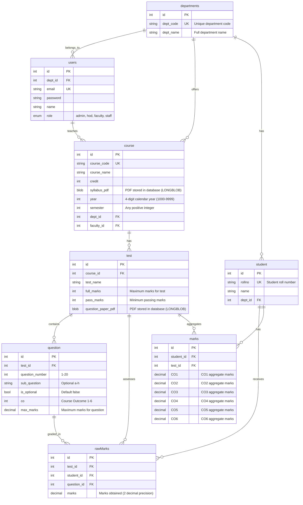

```mermaid
erDiagram
    departments ||--o{ users : "belongs_to"
    departments ||--o{ course : "offers"
    departments ||--o{ student : "has"
    users ||--o{ course : "teaches"
    course ||--o{ test : "has"
    test ||--o{ question : "contains"
    test ||--o{ rawMarks : "assesses"
    test ||--o{ marks : "aggregates"
    student ||--o{ rawMarks : "receives"
    student ||--o{ marks : "has"
    question ||--o{ rawMarks : "graded_in"

    departments {
        int id PK
        string dept_code UK "Unique department code"
        string dept_name "Full department name"
    }

    users {
        int id PK
        int dept_id FK
        string email UK
        string password
        string name
        enum role "admin, hod, faculty, staff"
    }

    course {
        int id PK
        string course_code UK
        string course_name
        int credit
        blob syllabus_pdf "PDF stored in database (LONGBLOB)"
        int year "4-digit calendar year (1000-9999)"
        int semester "Any positive integer"
        int dept_id FK
        int faculty_id FK
    }

    test {
        int id PK
        int course_id FK
        string test_name
        int full_marks "Maximum marks for test"
        int pass_marks "Minimum passing marks"
        blob question_paper_pdf "PDF stored in database (LONGBLOB)"
    }

    question {
        int id PK
        int test_id FK
        int question_number "1-20"
        string sub_question "Optional a-h"
        bool is_optional "Default false"
        int co "Course Outcome 1-6"
        decimal max_marks "Maximum marks for question"
    }

    student {
        int id PK
        string rollno UK "Student roll number"
        string name
        int dept_id FK
    }

    rawMarks {
        int id PK
        int test_id FK
        int student_id FK
        int question_id FK
        decimal marks "Marks obtained (2 decimal precision)"
    }

    marks {
        int id PK
        int student_id FK
        int test_id FK
        decimal CO1 "CO1 aggregate marks"
        decimal CO2 "CO2 aggregate marks"
        decimal CO3 "CO3 aggregate marks"
        decimal CO4 "CO4 aggregate marks"
        decimal CO5 "CO5 aggregate marks"
        decimal CO6 "CO6 aggregate marks"
    }
```