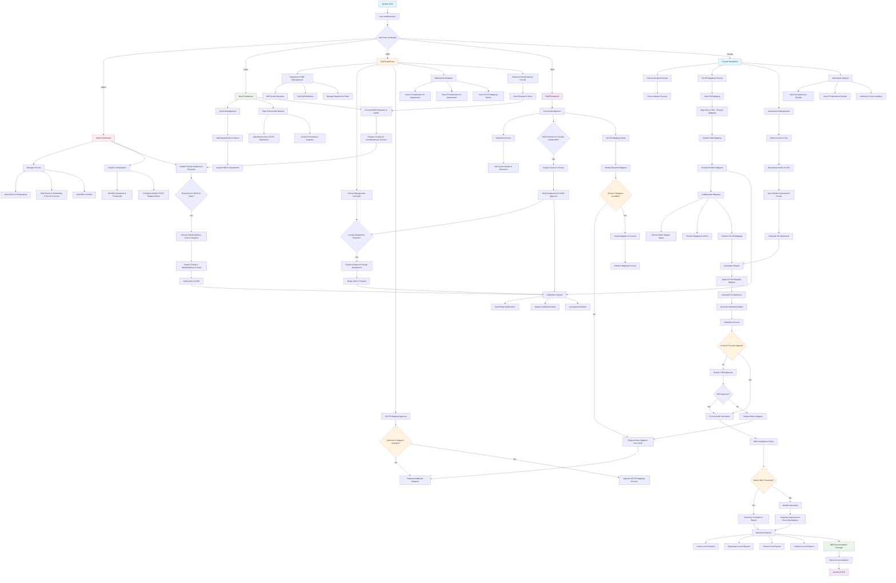

```mermaid
flowchart TD

    A[System Start] --> B[User Authentication]
    B --> C{User Role Verification}

    %% Admin Workflow
    C -->|Admin| D[Admin Dashboard]
    D --> D1[Manage Schools]
    D1 --> D2[Add School of Engineering]
    D1 --> D3[Add School of Humanities & Social Sciences]
    D1 --> D4[Add Other Schools]

    D --> D5[Handle Faculty Assignment Requests]
    D5 --> D6{Request from HOD via Dean?}
    D6 -->|Yes| D7[Review Interdisciplinary Course Request]
    D7 --> D8[Assign Faculty to Interdisciplinary Course]
    D8 --> D9[Notify Dean & HOD]

    D --> D10[System Configuration]
    D10 --> D11[Set NBA Standards & Thresholds]
    D10 --> D12[Configure Global CO-PO Mapping Rules]

    %% Dean Workflow
    C -->|Dean| E[Dean Dashboard]
    E --> E1[School Management]
    E1 --> E2[Add Departments in School]
    E2 --> E3[Assign HOD to Department]

    E --> E4[View School-wide Reports]
    E4 --> E5[Department-wise CO-PO Attainment]
    E4 --> E6[School Performance Analytics]

    E --> E7[Forward HOD Requests to Admin]
    E7 --> E8[Request Faculty for Interdisciplinary Courses]
    E8 --> D5

    %% HOD Workflow
    C -->|HOD| F[HOD Dashboard]
    F --> F1[Department Staff Management]
    F1 --> F2[Add Faculty Members]
    F1 --> F3[Add Staff Members]
    F1 --> F4[Manage Department Roles]

    F --> F5[Course Management Oversight]
    F5 --> F6{Faculty Assignment Request?}
    F6 -->|Yes| F7[Review & Approve Faculty Assignment]
    F7 --> F8[Notify Staff to Proceed]

    F --> F9[CO-PO Mapping Approval]
    F9 --> F10{Minimum 3 Mappers Available?}
    F10 -->|No| F11[Request Additional Mappers]
    F10 -->|Yes| F12[Approve CO-PO Mapping Process]

    F --> F13[Department Analytics]
    F13 --> F14[View CO Attainment for Department]
    F13 --> F15[View PO Attainment for Department]
    F13 --> F16[View CO-PO Mapping Status]

    F --> F17[Request Interdisciplinary Faculty]
    F17 --> F18[Send Request to Dean]
    F18 --> E7

    %% Staff Workflow
    C -->|Staff| G[Staff Dashboard]
    G --> G1[Course Management]
    G1 --> G2[Add New Courses]
    G2 --> G3[Set Course Details & Outcomes]

    G1 --> G4{HOD Direction for Faculty Assignment?}
    G4 -->|Yes| G5[Assign Faculty to Course]
    G5 --> G6[Send Assignment for HOD Approval]
    G6 --> F6

    G1 --> G7[CO-PO Mapping Setup]
    G7 --> G8[Identify Required Mappers]
    G8 --> G9{At least 3 Mappers Available?}
    G9 -->|No| G10[Request More Mappers from HOD]
    G10 --> F11
    G9 -->|Yes| G11[Assign Mappers to Course]
    G11 --> G12[Initialize Mapping Process]

    %% Faculty Workflow
    C -->|Faculty| H[Faculty Dashboard]
    H --> H1[Course Assignment View]
    H1 --> H2[View Assigned Courses]

    H --> H3[CO-PO Mapping Process]
    H3 --> H4[Initial Self-Mapping]
    H4 --> H5[Map COs to POs - Primary Mapping]
    H5 --> H6[Submit Initial Mapping]
    H6 --> H7[Forward to Other Mappers]

    H7 --> H8[Collaborative Mapping]
    H8 --> H9[Review Other Mapper Inputs]
    H8 --> H10[Resolve Mapping Conflicts]
    H8 --> H11[Finalize CO-PO Mapping]

    H --> H12[Assessment Management]
    H12 --> H13[Select Course & Test]
    H13 --> H14[Map Assessments to COs]
    H14 --> H15[Input Student Assessment Scores]
    H15 --> H16[Calculate CO Attainment]

    H --> H17[Attainment Analysis]
    H17 --> H18[View CO Attainment Results]
    H17 --> H19[View PO Attainment Results]
    H17 --> H20[Individual Course Analytics]

    %% Calculation Engine
    H11 --> I[Calculation Engine]
    H16 --> I
    I --> I1[Apply CO-PO Mapping Weights]
    I1 --> I2[Calculate PO Attainment]
    I2 --> I3[Generate Attainment Matrix]

    %% Validation Process
    I3 --> J[Validation Process]
    J --> J1{At least 3 Faculty Mapped?}
    J1 -->|No| J2[Require HOD Approval]
    J2 --> J3{HOD Approves?}
    J3 -->|Yes| J4[Proceed with Calculation]
    J3 -->|No| J5[Request More Mappers]
    J5 --> G10
    J1 -->|Yes| J4

    %% NBA Compliance
    J4 --> K[NBA Compliance Check]
    K --> K1{Meets NBA Thresholds?}
    K1 -->|Yes| K2[Generate Compliance Report]
    K1 -->|No| K3[Identify Gap Areas]
    K3 --> K4[Generate Improvement Recommendations]

    %% Final Reports
    K2 --> L[Multi-level Reports]
    K4 --> L
    L --> L1[Course Level Reports]
    L --> L2[Department Level Reports]
    L --> L3[School Level Reports]
    L --> L4[Institution Level Reports]

    L --> L5[NBA Documentation Package]
    L5 --> L6[Export for Accreditation]
    L6 --> M[Archive & End]

    %% Notification System
    D9 --> N[Notification System]
    F8 --> N
    G6 --> N
    H7 --> N
    N --> N1[Send Email Notifications]
    N --> N2[Update Dashboard Alerts]
    N --> N3[Log System Activities]

    %% Styling
    style A fill:#e1f5fe
    style M fill:#f3e5f5
    style K1 fill:#fff3e0
    style F10 fill:#fff3e0
    style G9 fill:#fff3e0
    style J1 fill:#fff3e0
    style L5 fill:#e8f5e8

    %% Role-based styling
    style D fill:#ffebee
    style E fill:#e8f5e8
    style F fill:#fff3e0
    style G fill:#f3e5f5
    style H fill:#e1f5fe
```
