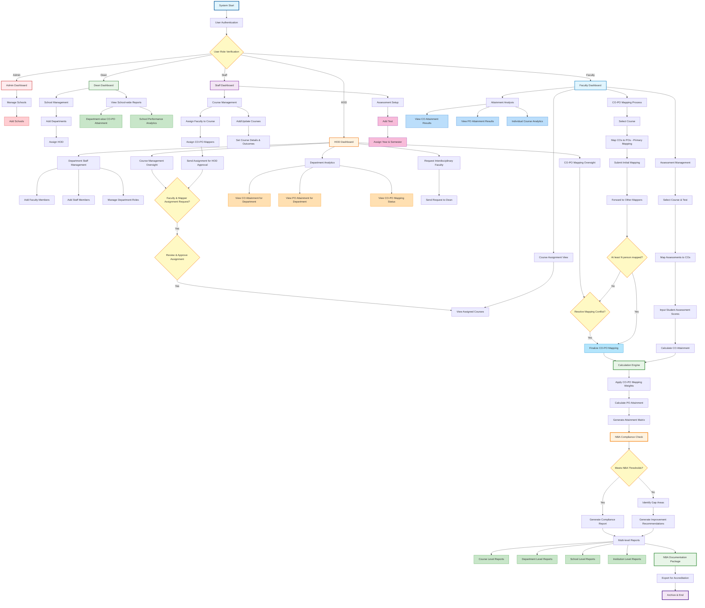

# NBA CO-PO Attainment Calculator - Final Workflow

## Complete System Architecture & Process Flow

```mermaid
flowchart TD
    %% ==================== AUTHENTICATION LAYER ====================
    A[System Start] --> B[User Authentication]
    B --> C{User Role Verification}

    %% ==================== ADMIN WORKFLOW ====================
    C -->|Admin| D[Admin Dashboard]
    D --> D1[Manage Schools]
    D1 --> D2[Add Schools]

    %% ==================== DEAN WORKFLOW ====================
    C -->|Dean| E[Dean Dashboard]

    %% Dean - School Management Section
    E --> E1[School Management]
    E1 --> E2[Add Departments]
    E2 --> E3[Assign HOD]

    %% Dean - Reporting Section
    E --> E4[View School-wide Reports]
    E4 --> E5[Department-wise CO-PO Attainment]
    E4 --> E6[School Performance Analytics]

    %% ==================== HOD WORKFLOW ====================
    C -->|HOD| F[HOD Dashboard]

    %% HOD - Staff Management Section
    F --> F1[Department Staff Management]
    F1 --> F2[Add Faculty Members]
    F1 --> F3[Add Staff Members]
    F1 --> F4[Manage Department Roles]

    %% HOD - Course Oversight Section
    F --> F5[Course Management Oversight]
    F5 --> F6{Faculty & Mapper Assignment Request?}
    F6 -->|Yes| F7{Review & Approve Assignment}
    F7 -->|Yes| H2[View Assigned Courses]

    %% HOD - Analytics Section
    F --> F8[Department Analytics]
    F8 --> F9[View CO Attainment for Department]
    F8 --> F10[View PO Attainment for Department]
    F8 --> F11[View CO-PO Mapping Status]

    %% HOD - External Coordination Section
    F --> F12[Request Interdisciplinary Faculty]
    F12 --> F13[Send Request to Dean]

    %% HOD - Mapping Oversight Section
    F --> F14[CO-PO Mapping Oversight]
    F14 --> F15{Resolve Mapping Conflict?}
    F15 -->|Yes| H11[Finalize CO-PO Mapping]

    %% ==================== STAFF WORKFLOW ====================
    C -->|Staff| G[Staff Dashboard]

    %% Staff - Course Management Section
    G --> G1[Course Management]
    G1 --> G2[Add/Update Courses]
    G2 --> G3[Set Course Details & Outcomes]
    G1 --> G4[Assign Faculty to Course]
    G4 --> G5[Assign CO-PO Mappers]
    G5 --> G6[Send Assignment for HOD Approval]
    G6 --> F6

    %% Staff - Assessment Setup Section
    G --> G7[Assessment Setup]
    G7 --> G8[Add Test]
    G8 --> G9[Assign Year & Semester]

    %% ==================== FACULTY WORKFLOW ====================
    C -->|Faculty| H[Faculty Dashboard]

    %% Faculty - Course Assignment Section
    H --> H1[Course Assignment View]
    H1 --> H2

    %% Faculty - CO-PO Mapping Section
    H --> H3[CO-PO Mapping Process]
    H3 --> H4[Select Course]
    H4 --> H5[Map COs to POs - Primary Mapping]
    H5 --> H6[Submit Initial Mapping]
    H6 --> H7[Forward to Other Mappers]
    H7 --> H8{At least N person mapped?}
    H8 -->|Yes| H11
    H8 -->|No| F15

    %% Faculty - Assessment Section
    H --> H9[Assessment Management]
    H9 --> H10[Select Course & Test]
    H10 --> H12[Map Assessments to COs]
    H12 --> H13[Input Student Assessment Scores]
    H13 --> H14[Calculate CO Attainment]

    %% Faculty - Analysis Section
    H --> H15[Attainment Analysis]
    H15 --> H16[View CO Attainment Results]
    H15 --> H17[View PO Attainment Results]
    H15 --> H18[Individual Course Analytics]

    %% ==================== CALCULATION ENGINE ====================
    H11 --> I[Calculation Engine]
    H14 --> I
    I --> I1[Apply CO-PO Mapping Weights]
    I1 --> I2[Calculate PO Attainment]
    I2 --> I3[Generate Attainment Matrix]

    %% ==================== NBA COMPLIANCE & REPORTING ====================
    I3 --> J[NBA Compliance Check]
    J --> J1{Meets NBA Thresholds?}
    J1 -->|Yes| J2[Generate Compliance Report]
    J1 -->|No| J3[Identify Gap Areas]
    J3 --> J4[Generate Improvement Recommendations]

    %% ==================== REPORTING SYSTEM ====================
    J2 --> K[Multi-level Reports]
    J4 --> K
    K --> K1[Course Level Reports]
    K --> K2[Department Level Reports]
    K --> K3[School Level Reports]
    K --> K4[Institution Level Reports]

    %% ==================== FINAL OUTPUT ====================
    K --> K5[NBA Documentation Package]
    K5 --> K6[Export for Accreditation]
    K6 --> L[Archive & End]

    %% ==================== STYLING ====================
    %% Authentication & System nodes
    style A fill:#e1f5fe,stroke:#01579b,stroke-width:3px
    style L fill:#f3e5f5,stroke:#4a148c,stroke-width:3px

    %% Role-based Dashboard Styling
    style D fill:#ffebee,stroke:#c62828,stroke-width:2px
    style E fill:#e8f5e8,stroke:#2e7d32,stroke-width:2px
    style F fill:#fff3e0,stroke:#ef6c00,stroke-width:2px
    style G fill:#f3e5f5,stroke:#7b1fa2,stroke-width:2px
    style H fill:#e1f5fe,stroke:#0277bd,stroke-width:2px

    %% Decision Nodes
    style C fill:#fff9c4,stroke:#f57f17,stroke-width:2px
    style F6 fill:#fff9c4,stroke:#f57f17,stroke-width:2px
    style F7 fill:#fff9c4,stroke:#f57f17,stroke-width:2px
    style F15 fill:#fff9c4,stroke:#f57f17,stroke-width:2px
    style H8 fill:#fff9c4,stroke:#f57f17,stroke-width:2px
    style J1 fill:#fff9c4,stroke:#f57f17,stroke-width:2px

    %% Key Process Nodes
    style I fill:#e8f5e8,stroke:#388e3c,stroke-width:3px
    style J fill:#fff3e0,stroke:#f57c00,stroke-width:3px
    style K5 fill:#e8f5e8,stroke:#388e3c,stroke-width:3px

    %% Admin Section
    style D2 fill:#ffcdd2,stroke:#d32f2f,stroke-width:1px

    %% Dean Section
    style E5 fill:#c8e6c9,stroke:#43a047,stroke-width:1px
    style E6 fill:#c8e6c9,stroke:#43a047,stroke-width:1px

    %% HOD Section
    style F9 fill:#ffe0b2,stroke:#fb8c00,stroke-width:1px
    style F10 fill:#ffe0b2,stroke:#fb8c00,stroke-width:1px
    style F11 fill:#ffe0b2,stroke:#fb8c00,stroke-width:1px

    %% Staff Section
    style G8 fill:#f8bbd9,stroke:#8e24aa,stroke-width:1px
    style G9 fill:#f8bbd9,stroke:#8e24aa,stroke-width:1px

    %% Faculty Section
    style H11 fill:#b3e5fc,stroke:#0288d1,stroke-width:1px
    style H16 fill:#bbdefb,stroke:#1976d2,stroke-width:1px
    style H17 fill:#bbdefb,stroke:#1976d2,stroke-width:1px
    style H18 fill:#bbdefb,stroke:#1976d2,stroke-width:1px

    %% Report Nodes
    style K1 fill:#c8e6c9,stroke:#43a047,stroke-width:1px
    style K2 fill:#c8e6c9,stroke:#43a047,stroke-width:1px
    style K3 fill:#c8e6c9,stroke:#43a047,stroke-width:1px
    style K4 fill:#c8e6c9,stroke:#43a047,stroke-width:1px
```
