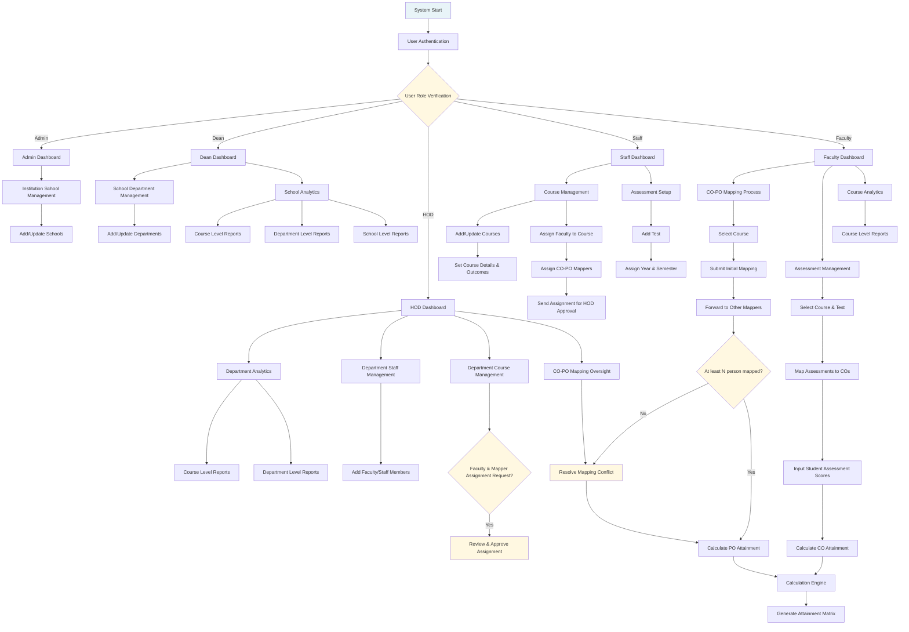

```mermaid

flowchart TD

A[System Start] --> B[User Authentication]
B --> C{User Role Verification}


C -->|Admin| D[Admin Dashboard]
D --> D1[Institution School Management]
D1 --> D2[Add/Update Schools]

C -->|Dean| E[Dean Dashboard]
E --> E1[School Department Management]
E1 --> E2[Add/Update Departments]

E --> L[School Analytics]
L --> L1[Course Level Reports]
L --> L2[Department Level Reports]
L --> L3[School Level Reports]

C -->|HOD| F[HOD Dashboard]
F --> Z[Department Analytics]
Z --> Z1[Course Level Reports]
Z --> Z2[Department Level Reports]

F --> F1[Department Staff Management]
F1 --> F2[Add Faculty/Staff Members]
F --> F5[Department Course Management]
F5 --> F6{Faculty & Mapper Assignment Request?}
F6 -->|Yes| F7[Review & Approve Assignment]
F --> F14[CO-PO Mapping Oversight]
F14 --> F15[Resolve Mapping Conflict]
F15 --> H11

C -->|Staff| G[Staff Dashboard]
G --> G1[Course Management]
G1 --> G2[Add/Update Courses]
G2 --> G3[Set Course Details & Outcomes]
G1 --> G4[Assign Faculty to Course]
G4 --> G5[Assign CO-PO Mappers]
G5 --> G6[Send Assignment for HOD Approval]
G --> G7[Assessment Setup]
G7 --> G8[Add Test]
G8 --> G9[Assign Year & Semester]

C -->|Faculty| H[Faculty Dashboard]
H --> H3[CO-PO Mapping Process]
H3 --> H4[Select Course]
H4 --> H6[Submit Initial Mapping]
H6 --> H7[Forward to Other Mappers]
H7 --> H8{At least N person mapped?}
H8 -->|No| F15
H8 -->|Yes| H11[Calculate PO Attainment]

H --> H9[Assessment Management]
H9 --> H10[Select Course & Test]
H10 --> H12[Map Assessments to COs]
H12 --> H13[Input Student Assessment Scores]
H13 --> H14[Calculate CO Attainment]

H11 --> I[Calculation Engine]
H14 --> I
I --> I3[Generate Attainment Matrix]

H --> Y[Course Analytics]
Y --> Y1[Course Level Reports]

style A fill:#e8f4f8
style C fill:#fff8e1
style F6 fill:#fff8e1
style F7 fill:#fff8e1
style F15 fill:#fff8e1
style H8 fill:#fff8e1

```
